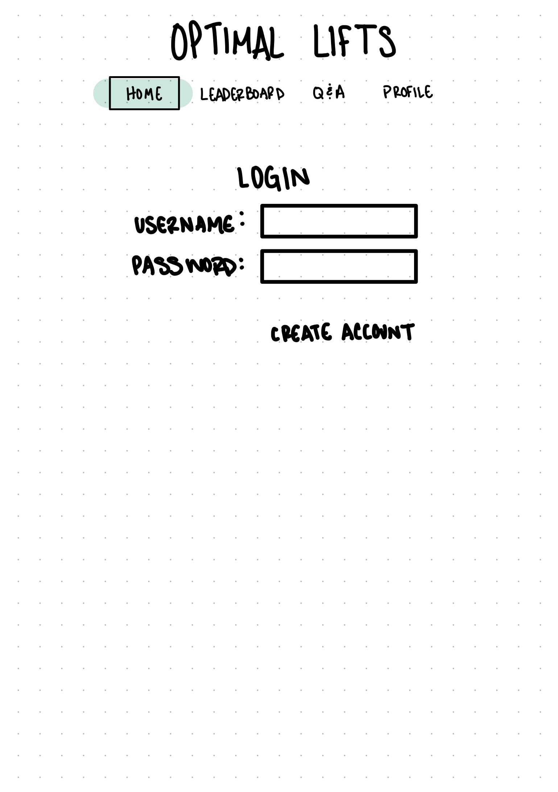
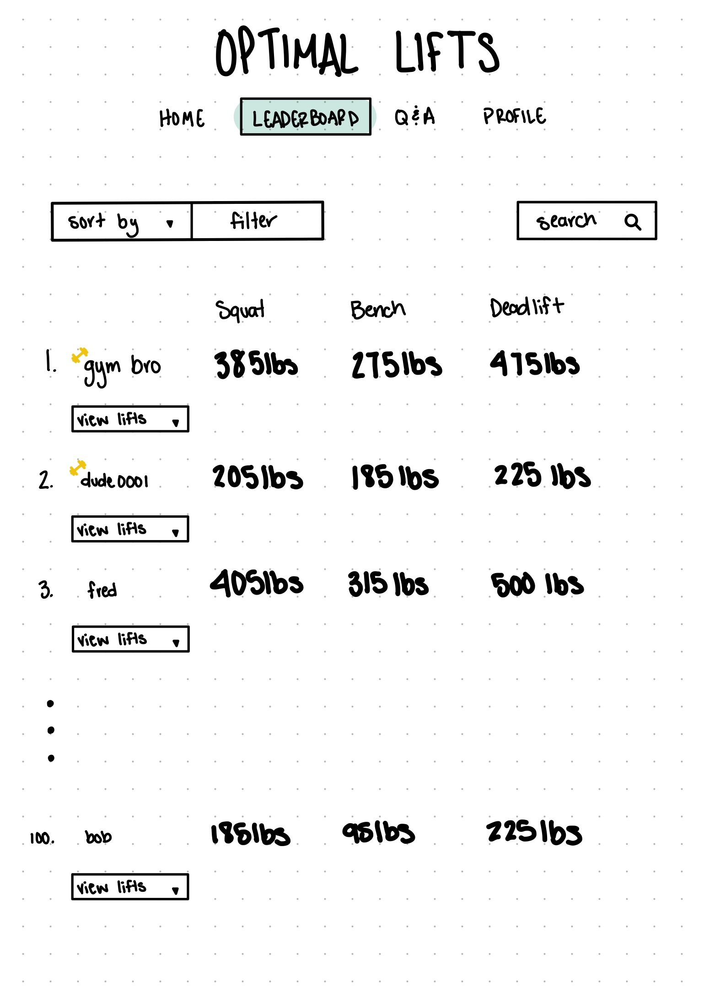
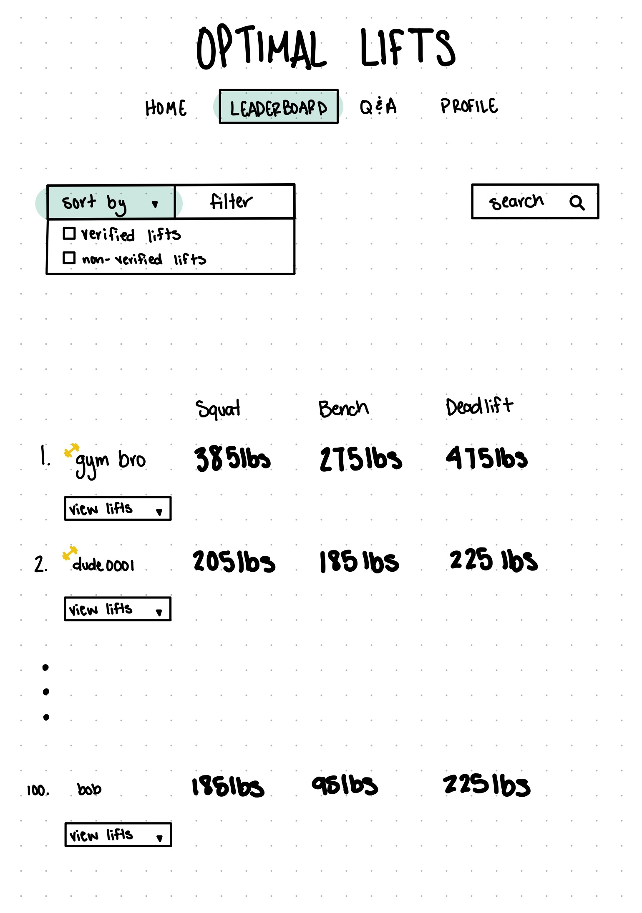
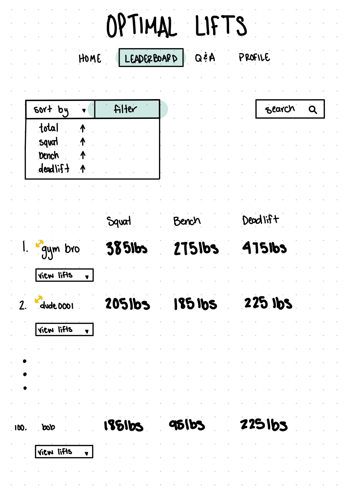
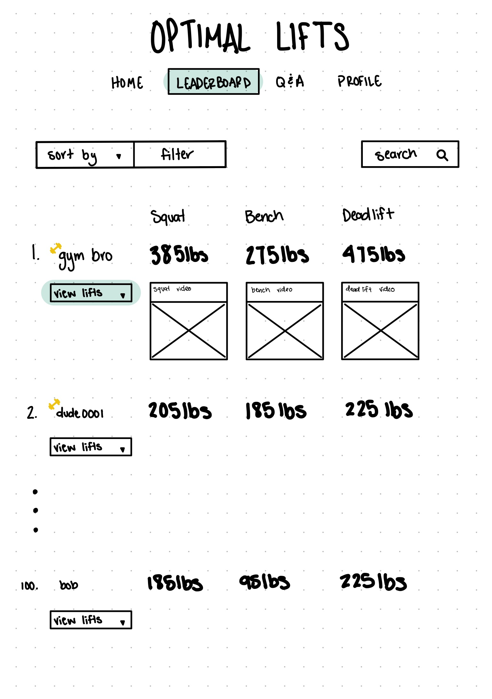
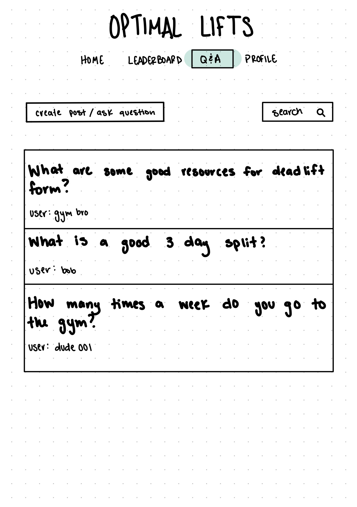
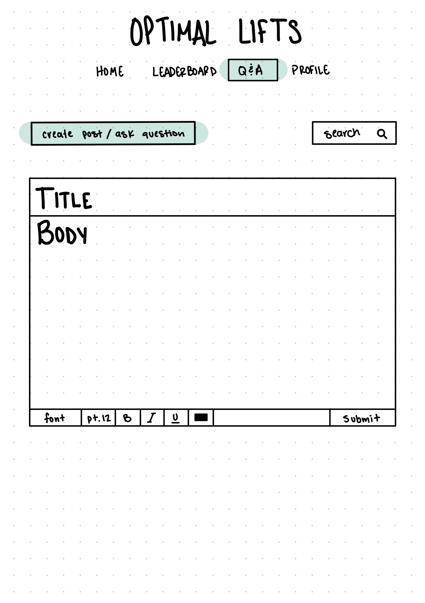
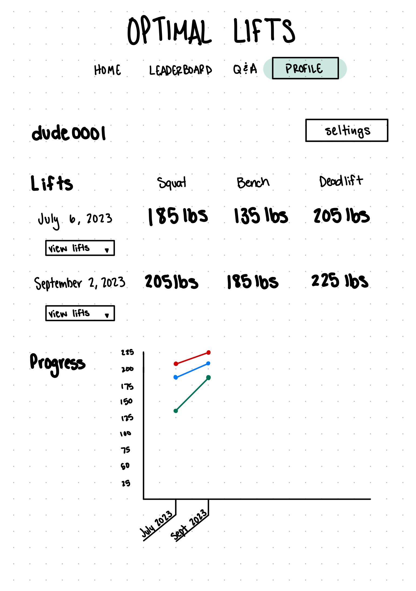

# Optimal Lift's 

## Description deliverable

### Elevator pitch 

Ever wanted to be able to see where you rank amoungst other lifters or simply track your progress in the gym? Optimal Lift's is a place where lifters can do just that and more. It is a place to track and compare your lifts as well as get advice or talk about whats new in the world of lifting. Optimal Lift's has it all!

### Design

**Home**

**Leaderboard**

  

 

**Q&A**

 

**Profile**

### Key features

- Secure login over HTTPS
- Ability to upload lifts 
- Ability to upload videos
- Display a leaderboard of top lifters
- Ask questions 
- Start disscusions
- Track progress

### Technology

I am going to use the required technologies in the following ways.

- **HTML** - Uses correct HTML structure for application. Five HTML pages for login, profile, home, leaderboard, and q&a. Hyperlinks to choice artifact.
- **CSS** - Application styling that looks good on different screen sizes, uses good whitespace, color choice and contrast.
- **JavaScript** - Provides login, display leaderboard, q&a, track personal growth, backend endpoint calls.
- **Service** - Backend service with endpoints for:
  - login
  - submitting lifts
  - submiting questions
  - submitting disscusions
  - retriving lifts
  - retriving questions
  -retriving disscusions
- **DB** - Store users, lifts, videos, questions, and disscusions.
- **Login** - Register and login users. Credentials securely stored in database. Can't upload lifts and videos unless authenticated.
- **WebSocket** - As each lifter posts their totals, their totals are broadcasted to other users.
- **React** - Application ported to use the React web framework.

## HTML deliverable

For this deliverable I built out the structure of my application using HTML.

- **HTML pages** - Five HTML pages that represent the ability to login, check the leaderboard, view and create posts, and check your progress.
- **Links** - All the pages are linked to one another, in the Q&A page there are placeholders to link you to other peoples posts and one to link you to the page to create a post.
- **Text** - There is text to show the rankings of different lifters and to see others questions and answers.
- **Images** - No images at the moment do not know if I need them but I did create a graph for the user to track their progress in another way.
- **Login** - Input box and submit button for login.
- **Database** - The leaderboard lifts and viewing comments on others posts are going to require getting and storing data.
- **WebSocket** - Post videos liknked to their lifts and to get people to others posts and to create your own.